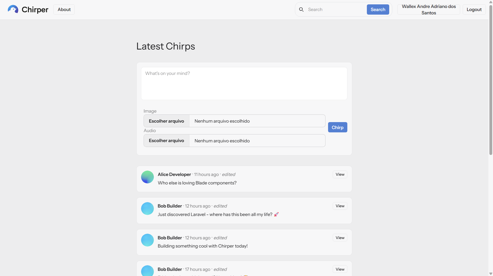
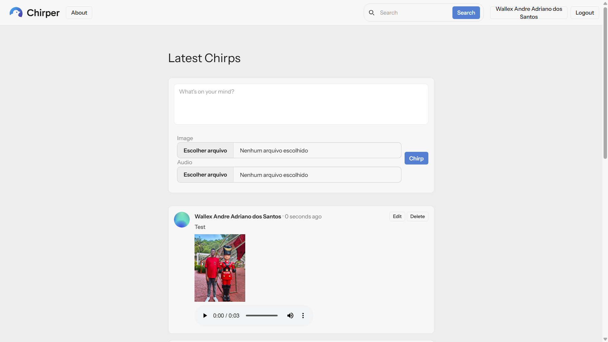
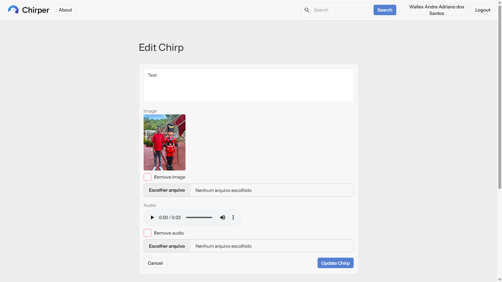
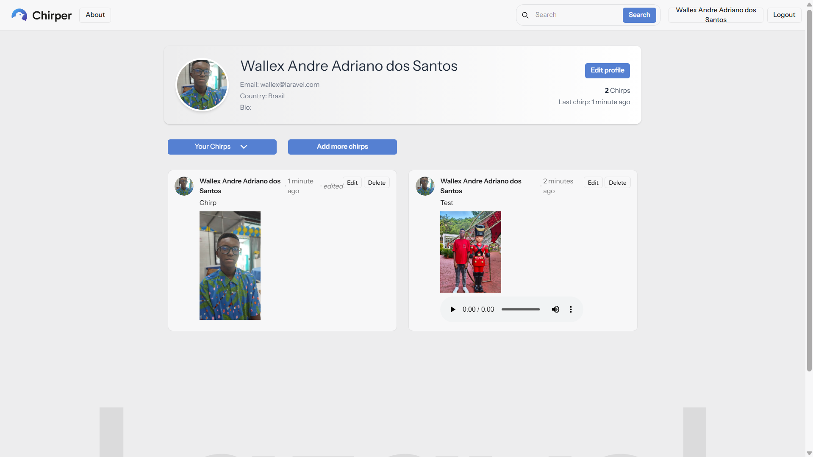
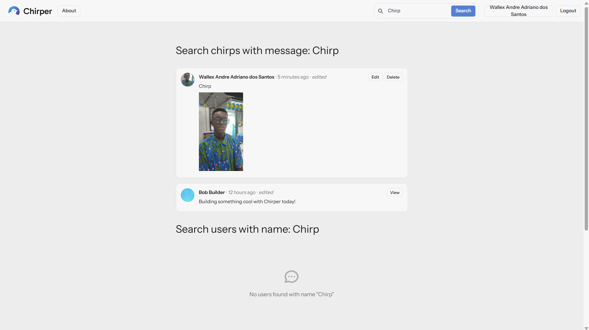
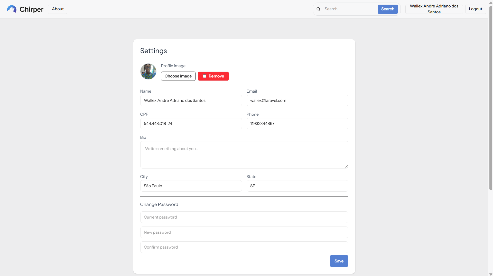

# 🐦 Chirper - Plataforma de Comunicação

O Chirper é uma plataforma leve de comunicação onde usuários podem publicar mensagens curtas, compartilhar conteúdo multimídia e interagir com outros perfis em um ambiente simples, rápido e organizado.

O projeto foi desenvolvido como parte de estudos práticos em desenvolvimento de sistemas, com foco em autenticação, manipulação de dados, upload de arquivos e organização de aplicações web.

---

## 🎯 Sobre o Projeto

Este sistema simula uma plataforma de comunicação moderna, permitindo que os usuários:

- Criem publicações (chirps)
- Enviem imagens e áudios
- Editem ou removam suas publicações
- Acessem um feed global de posts
- Pesquisem usuários e publicações
- Visualizem perfis de outros usuários

O projeto foi inspirado no Laravel Bootcamp, mas expandido com funcionalidades adicionais para simular um sistema mais completo e realista.

---

## ✨ Funcionalidades

### 📝 Sistema de Posts
- Criar chirps
- Editar chirps
- Excluir chirps
- Feed global com posts mais recentes

### 📂 Sistema de Mídia
- Upload de imagens
- Upload de áudio
- Preview antes de enviar
- Substituição ou remoção de mídia na edição

### 👤 Sistema de Usuários
- Login e registro
- Página de perfil
- Edição de perfil
- Upload de imagem de perfil
- Visualização de outros usuários
- Filtragem de posts por usuário

### 🔍 Sistema de Busca
- Busca de posts por conteúdo
- Busca de usuários por nome

### 🔐 Segurança
- Policies (somente o dono pode editar/excluir)
- Validação de formulários
- Controle seguro de upload de arquivos

---

## 🧠 Conceitos Aplicados

- Arquitetura MVC
- ORM (Eloquent)
- Relacionamentos entre tabelas
- Validação de requisições
- Sistema de storage (arquivos)
- Autorização baseada em regras (Policies)
- Estrutura REST com Controllers

---

## 🛠️ Tecnologias Utilizadas

- PHP
- Laravel
- MySQL / SQLite
- Tailwind CSS
- DaisyUI
- JavaScript
- Git & GitHub

---

## 🖼️ Screenshots

### Página Inicial (Feed)

---

### Criar Publicação

---

### Editar Publicação

---

### Perfil de Usuário

---

### Sistema de Busca

---

### Configurações de Usuário

---

## 🚀 Links do Projeto

- 🌐 Versão online (Laravel Cloud):  
https://chirper-main-wallex.free.laravel.cloud/

- 💻 Repositório GitHub:  
https://github.com/Wallex-Andre

---

## 📌 Objetivo

Este projeto tem como objetivo demonstrar a construção de um sistema completo de comunicação, aplicando conceitos reais de desenvolvimento de sistemas, como autenticação, manipulação de dados, controle de acesso e estruturação de aplicações modernas.

---

## 👨‍💻 Autor

**Wallex**